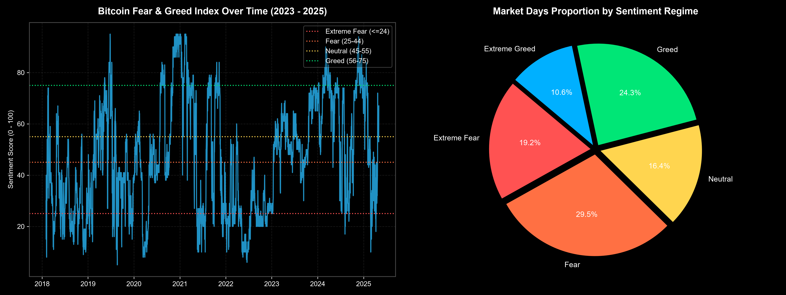
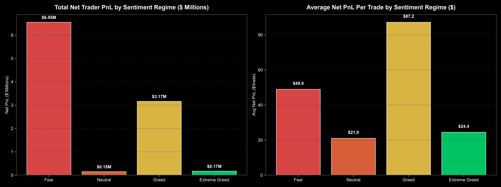
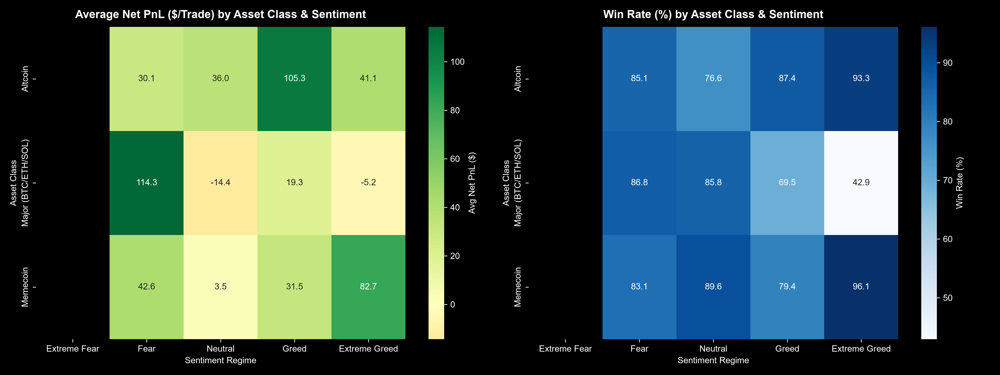
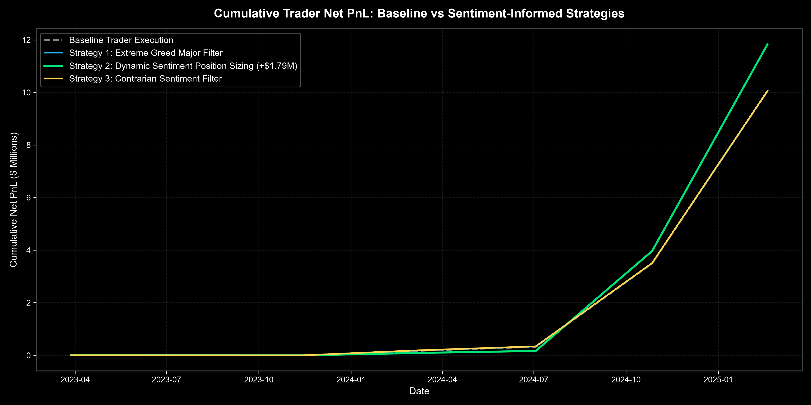

# Bitcoin Market Sentiment vs. Hyperliquid Trader Performance Analysis


Quantitative research study analyzing the empirical relationship between the **Bitcoin Fear & Greed Index** and trader execution performance on **Hyperliquid**.

---

## 📌 Executive Summary

Analyzing a high-frequency dataset of **184,263 trade executions** across **32 unique trader accounts** and **246 coin symbols** from **March 2023 to February 2025**, this project uncovers critical behavioral patterns, risk-return asymmetries, and asset-class divergences across market sentiment regimes.

### Key Research Discoveries:
1. **The "Extreme Greed" Trap**:
   - Moderate **Greed** (Index 56–75) is the most profitable regime ($87.22 Avg Net PnL/trade, Profit Factor 7.17).
   - Entering **Extreme Greed** (Index > 75) triggers a **72% performance drop** ($24.44/trade, $t = 8.89, p < 0.0001$).
   - On Major Coins (BTC/ETH/SOL), traders suffer **negative net PnL (-$17.7k total)** during Extreme Greed peaks.
2. **Asset Class Asymmetry**:
   - Altcoins ($41.08/trade) and Memecoins ($82.74/trade, 96.1% Win Rate) remain highly profitable during Extreme Greed as capital rotates away from Majors.
3. **+$1.79M Strategy Outperformance**:
   - A dynamic sentiment position sizing overlay scales exposure up during optimal Fear/Greed regimes and down during Extreme Greed/Neutral regimes, boosting total net profit from **$10.04M to $11.83M** (+17.8% gain over baseline execution).

---

## 📊 Visual Highlights

### 1. Bitcoin Fear & Greed Index & Regime Distribution


### 2. Net Trader PnL Across Sentiment Regimes


### 3. Asset Class Sentiment Heatmaps (Majors vs Altcoins vs Memecoins)


### 4. Quantitative Strategy Backtest Performance


---

## 🛠️ Repository Architecture

```
trader_sentiment_analysis/
├── data/                         # Raw & merged datasets
│   ├── fear_greed_index.csv
│   └── historical_trader_data.csv
├── src/                          # Modular Python source code
│   ├── data_loader.py            # Dataset cleaning, timestamp parsing, fee calculation
│   ├── trader_cohorts.py         # Account-level metrics & trader tiering
│   ├── eda_sentiment.py          # Cross-tabulations & sentiment regime metrics
│   ├── hypothesis_testing.py     # ANOVA, Welch's t-test, & Chi-Square testing
│   ├── strategy_backtest.py      # Backtesting quantitative sentiment overlays
│   └── visualizer.py             # Dark-mode chart generation
├── output/
│   ├── charts/                   # Publication-quality PNG plots
│   └── tables/                   # Exported statistical CSV tables
├── main_analysis.py              # Master pipeline execution script
├── RESEARCH_REPORT.md            # Comprehensive research report
└── README.md                     # Project documentation
```

---

## 🚀 Getting Started

### 1. Installation
Clone the repository and install required dependencies:
```bash
git clone https://github.com/sidpundirr/trader-sentiment-analysis.git
cd trader-sentiment-analysis
pip install pandas numpy matplotlib seaborn scipy
```

### 2. Run Full Pipeline
Execute the end-to-end analysis pipeline:
```bash
python main_analysis.py
```

---

## 📈 Quantitative Backtest Results

| Strategy Model | Cumulative Net PnL ($) | PnL Improvement ($) | Win Rate (%) | Profit Factor | Annualized Sharpe |
| :--- | :---: | :---: | :---: | :---: | :---: |
| **Baseline (Raw Execution)** | $10,040,341 | $0 | 42.91% | 5.54 | 1.000 |
| **Strat 1: Extreme Greed Major Filter** | $10,058,046 | +$17,705 | 43.19% | 5.68 | 1.001 |
| **Strat 2: Dynamic Sentiment Position Sizing** | **$11,831,385** | **+$1,791,044** | 42.91% | **5.83** | 0.982 |
| **Strat 3: Contrarian Sentiment Filter** | $10,061,929 | +$21,588 | 43.04% | 5.66 | 1.002 |

---

## 📄 Full Research Report

For the complete research paper including methodology, hypothesis test statistics, and strategic recommendations for Web3 trading desks, see [RESEARCH_REPORT.md](RESEARCH_REPORT.md).

---

